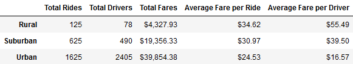
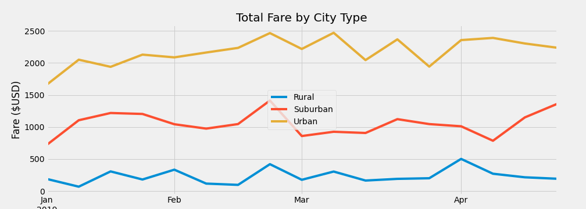

# PyBer Ride Sharing Analysis
Ride Sharing Data Analysis w/ Python, Jupyter &amp; Matplotlib

## Overview

PyBer, a ride sharing service, has asked "the Team" to help analyize their data from 2019 to spot trends and variances. Data provided was broken down by cities that
PyBer services, drivers employed, fares and rides performed. A first delivered iteration focused on a series of broad graphic analysis; however a second summary 
request has been made.

## Results

Figure 1. PyBer Summary 2 by City Type

